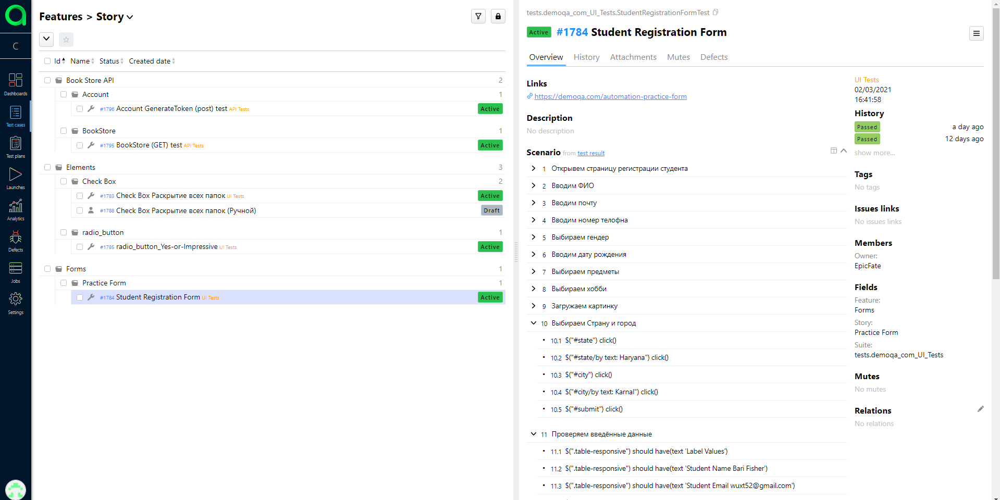
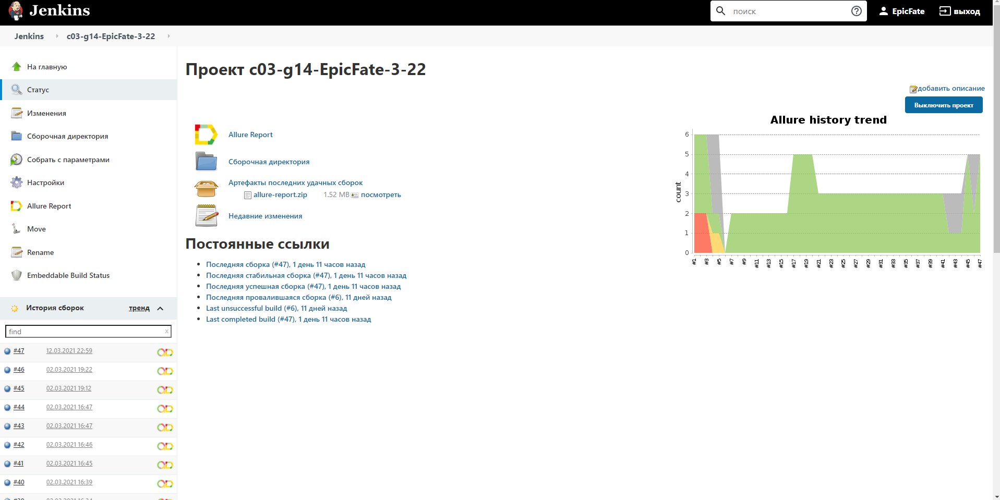

# qa.guru_3_22

1. Создать новый проект в Allure TestOps

2. Создать джобу в Jenkins со своими тестами (можно взять ваши наработки с demoqa.com)

3. Сконфигурируйте джобу в Jenkis для работы c Allure TestOps

4. Добавьте мета-данные в ваши автотесты

5. Добавьте мета-данные в проект в Allure TestOps

6. Добавьте два ручных теста в раздел Test Cases, автоматизируйте один из них.

### *Allure TestOps:*

### *Jenkins:*

